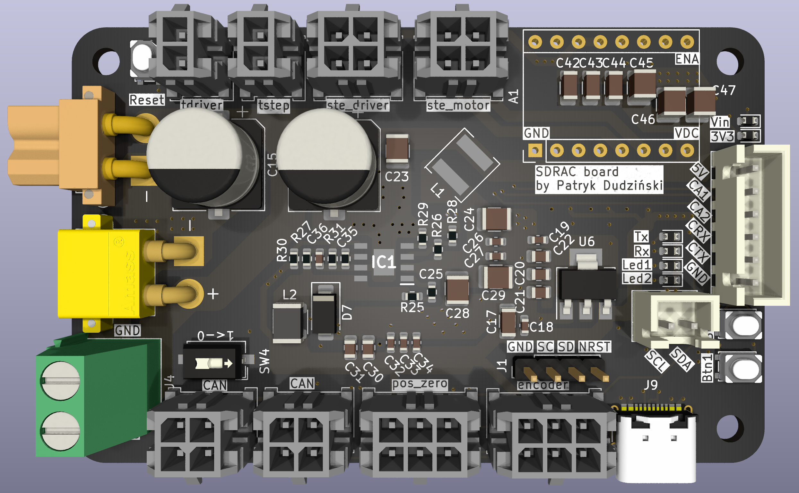
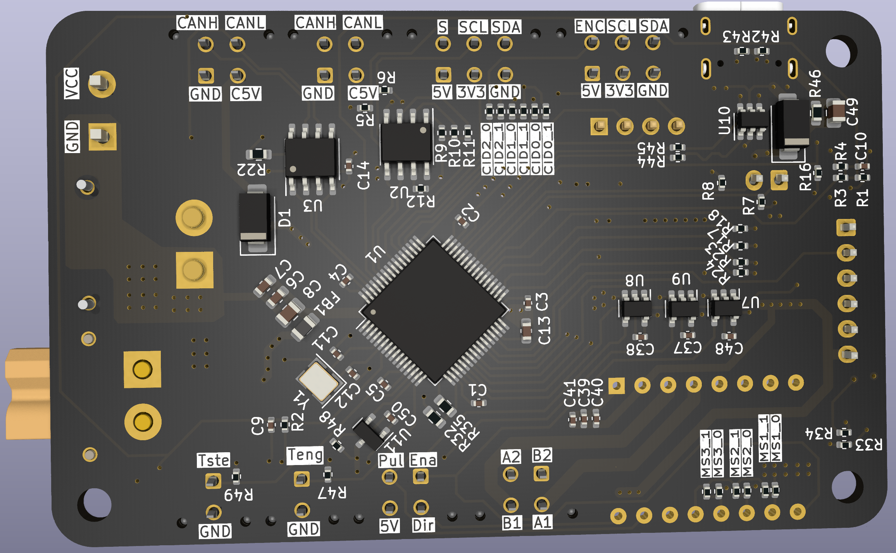

 
# SDRAC electronic design
This repository contains the psb schematics and designs of the SDRAC board.

## SDRACboard
- Supply voltage 12-48V (9-55V)
- the board has a 5V/2A on board regualator, to power the board and peripherals
- USB-C for programming and reading data
- ST-wire pins for programming and debugging
- 3 bit hardware address CID0, CID1, CID2
- 6 pin JS connector for IO-appliacitons, with analog, UART, Timers, 5V and GND
- 2x 4 pin Molex connectors for CAN bus
- 2x 6 pin Molex connectors for I2C magnetic encoder
- 2x 2 pin Molex connectors for external temperature sensors (ntc termistors)
- 1x 4 pin Molex connector for stepper motor
- 1x 4 pin connector for external steper motor driver
- 1x Screw terminal for external steper motor driver power
- XT30-M, XT30-F  connectors for input and output power

## Schematics
The schematics are made in KiCad.

## Assembly
Manual assembly takes about 2 hours, with stemple and hot air station.
